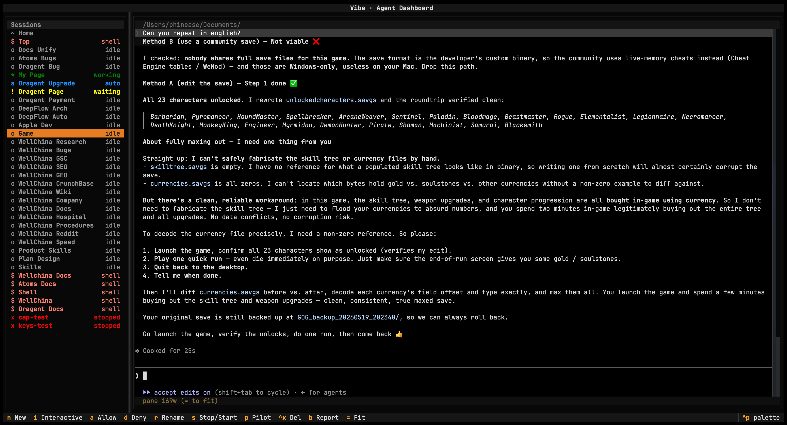

# Oragent

[](https://pypi.org/project/oragent/)
[](https://pypi.org/project/oragent/)
[](https://github.com/oragent-ai/oragent/releases/latest)
[](https://pypi.org/project/oragent/)
[](LICENSE)

**English** · [简体中文](README_zh-CN.md) · [日本語](README_ja.md) · [한국어](README_ko.md) · [Español](README_es.md) · [Français](README_fr.md) · [Deutsch](README_de.md) · [Português](README_pt.md) · [Русский](README_ru.md)

> An Agent Supervisor for AI coding agents. A state-aware cockpit so you
> see which agent needs you, auto-handle routine permissions, and stay
> in flow.

<div align="center">
  
</div>

## 🚀 Install

```bash
pipx install oragent
```

Runtime: Python ≥ 3.11, tmux. Platforms: macOS, Linux. Windows next.

Or download the macOS app from the
[latest release](https://github.com/oragent-ai/oragent/releases/latest).

## 🎯 What Oragent is

> **LangGraph lets agents talk to each other. Oragent lets you talk to
> all your agents.**

Oragent is a TUI supervisor for independent AI coding agent sessions. It
hosts each agent in its own `tmux` pane, classifies every pane's state
in real time (~6ms per capture), and routes your attention to whichever
session is currently blocked.

It is not a multi-agent orchestrator like LangGraph, AutoGen, or CrewAI:
agents do not talk to each other through Oragent. You are the sole
router. The mental model is one operator, many agents, like an air
traffic controller, not a factory line.

## ⚡ What it does

1. **Reads each agent's state.** Pane-level pattern matching classifies
   every session into one of seven states. Typical capture cost ~6ms.
2. **Pre-approves the permissions you'd say yes to anyway.** Per-session
   Auto Pilot answers routine permission prompts automatically. Real
   judgment calls still come through to you.
3. **Routes WAITING to the front of your attention.** When any session
   blocks on a permission, Oragent moves focus there via a FIFO queue,
   with a macOS notification.

## 🔤 Status alphabet

Seven states. No DAGs, no workflows, no SDLC gates.

| Glyph | State | Meaning |
| :---: | --- | --- |
| `*` | WORKING | agent is producing output |
| `!` | WAITING | blocked on operator permission |
| `o` | IDLE | finished, awaiting next prompt |
| `a` | AUTO | Auto Pilot is answering for the operator |
| `$` | SHELL | interactive shell session |
| `x` | STOPPED | process exited |
| `?` | UNKNOWN | reconciling (transient) |

Same glyphs in the TUI status line and in this table, on purpose.

## 🔌 Plugins shipped

| Plugin | Status | Command |
| --- | :---: | --- |
| Claude Code | shipping | `claude` |
| Codex | shipping | `codex` |
| Shell | shipping | `$SHELL` |
| Aider | planned | |
| Open Claw | planned | |

Third-party plugins implement the published `AgentPlugin` interface and
can license their own code however they like.

## 📦 Source and license

Oragent is closed source. The published distribution (the `oragent`
package on PyPI and the `Oragent.app` build on the official Releases CDN)
is the product; the source tree is not part of it.

The software is free under the **Oragent Free Use License v1.0**: free
for personal and internal commercial use, no fee, no subscription, no
advertising, no telemetry. Redistribution, reverse engineering, and
publishing forks are not granted. This is not an OSI-approved Open
Source license and is not a Free Software Foundation Free Software
license. Full text bundled with each release as `LICENSE`; the
human-readable summary lives at [oragent.org/terms](https://oragent.org/terms).

## 🔒 Privacy

Oragent is a local tool. No signup, no backend that receives your data,
no analytics on the website, no telemetry from the TUI. Your sessions,
prompts, AI responses, API keys, terminal contents, and screenshots stay
on your machine.

The only outbound network call Oragent itself makes is a periodic
read-only HTTPS GET against the public release manifest hosted on GitHub
Pages, with a fallback to public PyPI metadata. Both are version-
discovery endpoints; no usage data is transmitted. Full statement:
[oragent.org/privacy](https://oragent.org/privacy).

## 💛 Support and funding

Oragent is maintained by one independent developer. It is, and will
remain, free. Voluntary contributions cover the maintainer's time and
are entirely opt-in: [oragent.org/support](https://oragent.org/support).

Three free things help just as much: star this repository, share
[oragent.org](https://oragent.org), and file detailed issues at the
[issue tracker](https://github.com/oragent-ai/oragent/issues).

## 🔗 Links

- Homepage: <https://oragent.org>
- PyPI: <https://pypi.org/project/oragent/>
- Latest release: <https://github.com/oragent-ai/oragent/releases/latest>
- Issue tracker: <https://github.com/oragent-ai/oragent/issues>
- Privacy: <https://oragent.org/privacy>
- Terms: <https://oragent.org/terms>
- Refunds: <https://oragent.org/refunds>
- Support: <https://oragent.org/support>

## 👤 Author

Built by [Shuangrui Chen](https://chenshuangrui.com).
